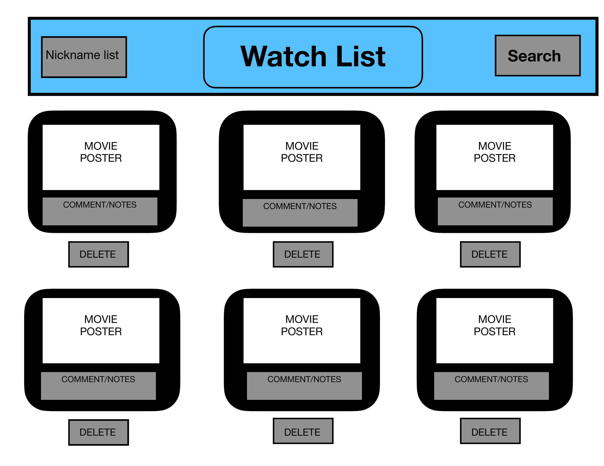

# Project 2 Pitch Guidelines

Project Description and Pitch Guidelines for SEIR SEA P2

---

## Project 2 Goals

In your second project you will create a full stack Express and Postgres app which has:

- _At least x2 models, and utilize and build at least one relationship between the two models._
- _Sequelize as an ORM to interact with and create your database._
- _An Express server utilizing EJS/EJS layouts for UI design and styling._
- _Interaction with and inclusion of at least one API._

## Project 2 Pitch Guidelines

In designing and building your project, you will start by forking and cloneing this repository, and then editing this README to include the following information:

1. Name of your app
   Try it out here:
   [WATCHLIST APP](https://my-movie-watchlists.herokuapp.com/)

2. Tech stack you plan to use

   - Sequelize, Postgresql
   - Express
   - Tailwind
   - Axios

3. Simple wireframes
   

4. API you plan to use

- OMBD API (http://www.omdbapi.com/)

5. Example of how to call/invoke your API, and a description of what data comes back.

- Console Log the API in VS Code for API.DATA
- Console.log() returned the following:

{
Title: 'Cool Runnings',
Year: '1993',
Rated: 'PG',
Released: '01 Oct 1993',
Runtime: '98 min',
Genre: 'Adventure, Comedy, Family',
Director: 'Jon Turteltaub',
Writer: 'Lynn Siefert, Michael Ritchie, Tommy Swerdlow',
Actors: 'John Candy, Leon, Doug E. Doug',
Plot: 'When a Jamaican sprinter is disqualified from the Olympic Games, he enlists the help of a dishonored coach to start the first Jamaican Bobsled Team.',
Language: 'English, German, Russian',
Country: 'United States',
Awards: '2 wins & 2 nominations',
Poster: 'https://m.media-amazon.com/images/M/MV5BMjMxMTQ3MzMwMV5BMl5BanBnXkFtZTgwNTYxNzYxMTE@._V1_SX300.jpg',
Ratings: [
{ Source: 'Internet Movie Database', Value: '7.0/10' },
{ Source: 'Rotten Tomatoes', Value: '76%' },
{ Source: 'Metacritic', Value: '60/100' }

.......Continued

6. MVP goals (x3-5)

[ ] User can create "To Watch List"

[ ] Movies can be searched for and added to individual "To Watch List"

[ ] Ability to delete movie from "To Watch List"

[ ] Ability to comment about each movies for to watch

7. Stretch goals (x2-5)

[ ] Add a recommended list that mulitple users can add to watch

[ ] Ability to comment about each movies for to watch

[ ] Make a moveable player

8. Any potential roadblocks?

[ ] Creating the models for user, watch list, maybe recommended page

[ ] Using CRUD to get added movies to another page

## How to get started

1. **Fork and clone this repository.**
2. **Edit the text above to include specifics of your project.**
3. **Commit, push, and submit a pull request to this repo with your edited pitch README.**
4. _After you have met with a staff member and your pitch has been approved, suggested next steps:_
   - Write out your routes and create a RESTful routing chart (good example [here](https://gk-hynes.github.io/restful-routes-chart/)).
   - Come up with a breakdown of what you plan to accomplish each day and how you are going to accomplish it.
   - Create a new git repo for your project.
   - Make all test API calls you need to to ensure your API will be usable for this project.
